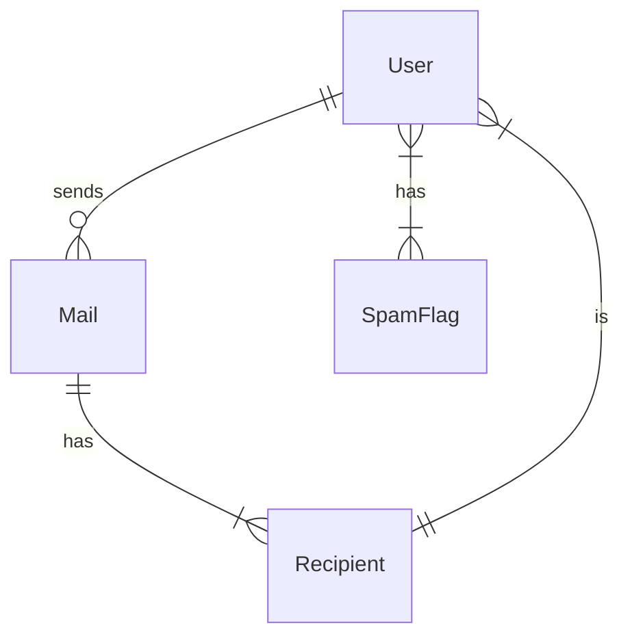
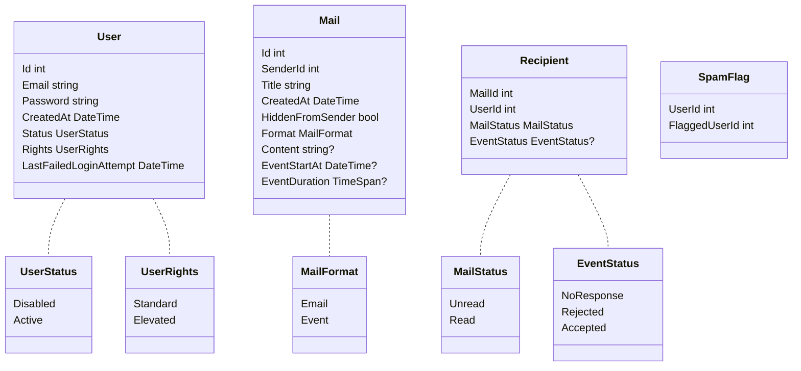

# Internship-7-EF-Dmail

Simulation of an email client.  
Main focus on Entity Framework, Postgres, LINQ and design patterns.

## Project setup

1. Edit `App.example.config`.
   - Edit the connection string within the file.
   - Rename `App.example.config` to `App.config`.
2. Apply migrations.
   - Open the `Package Manager Console` (Visual Studio) : `View > Other Windows > Package Manager Console`.
   - Make sure that the selected project is `Internship-7-EF-Dmail.Data`.
   - Run `Update-Database` in the Package Manager Console.

## Database

### Database diagram

### Entities

### Seed data

#### Login info

| Username                 | Password                 | Status | Rights   |
| ------------------------ | ------------------------ | ------ | -------- |
| `administrator@dmail.hr` | `administrator-password` | Active | Elevated |
| `user@dmail.hr`          | `user-password`          | Active | Standard |
| `dario@dmail.hr`         | `password`               | Active | Standard |

## Known limitations / bugs

| Limitation / bug                                                             | Description                                                                                                                                                                                                    |
| ---------------------------------------------------------------------------- | -------------------------------------------------------------------------------------------------------------------------------------------------------------------------------------------------------------- |
| Exit to parent menu / app reload required to reflect database changes in UI. | Even if the database contains the recent changes, some changes *seem* to be missing in the user interface. A exit to the parent menu / reload of the application is needed to reflect those changes in the UI. |
| Outbox mail deletion does not delete the mail.                               | Sent email / event deletion actually just hides the given mail from the senders outbox (*intended behavior from my perspective*).                                                                              |

## ToDos

| Status               | Title                                                                    | Description                                                                                                                                       |
| -------------------- | ------------------------------------------------------------------------ | ------------------------------------------------------------------------------------------------------------------------------------------------- |
| :white_check_mark:   | Some actions directly call `AuthAction.GetCurrentlyAuthenticatedUser()`. | Some actions are not following the dependency injection pattern. Fix by removing `AuthAction.GetCurrentlyAuthenticatedUser()` calls from Actions. |
| :white_large_square: | ~~Outbox event deletion does not cancel the event.~~                     | ~~Add `isCancelled` property to `Mail` entity.~~                                                                                                  |
| :white_check_mark:   | Outbox event deletion does not cancel the event.                         | Use `Mail.HiddenFromSender` property to determine whether a event is cancelled.                                                                   |
| :white_large_square: | Outbox mail not sorted correctly.                                        |                                                                                                                                                   |
