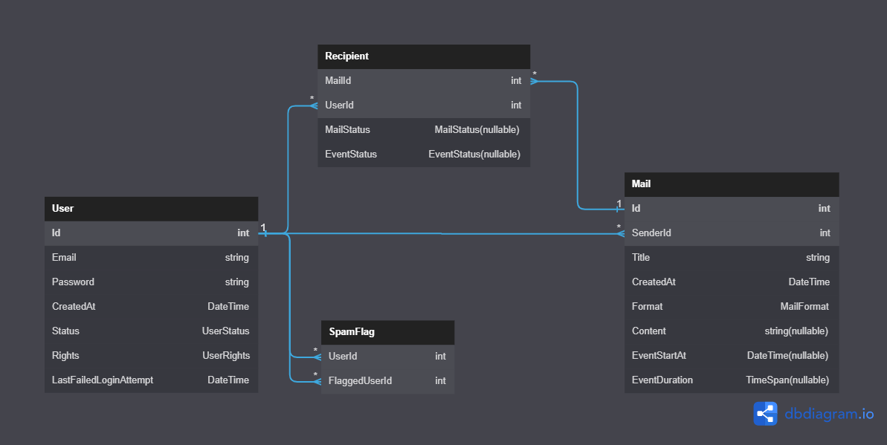

# Internship-7-EF-Dmail

Simulation of an email client.  
Main focus on Entity Framework, Postgres, LINQ and design patterns.

## Project setup
1. Edit `App.example.config`.
   - Edit the connection string.
   - Rename `App.example.config` to `App.config`.
2. Apply migrations.
   - Open the `Package Manager Console` (Visual Studio) : `View > Other Windows > Package Manager Console`.
   - Make sure that the selected project is `Internship-7-EF-Dmail.Data`.
   - Run `Update-Database` in the Package Manager Console.

## Database diagram

## Seed data

**Login info:**

| Username                 | Password                 |
| ------------------------ | ------------------------ |
| `administrator@dmail.hr` | `administrator-password` |
| `user@dmail.hr`          | `user-password`          |
| `dario@dmail.hr`         | `password`               |

## Known limitations

| Limitation                                                                  | Description                                                                                                                                                                                                     |
| --------------------------------------------------------------------------- | --------------------------------------------------------------------------------------------------------------------------------------------------------------------------------------------------------------- |
| ~~Some actions directly call `AuthAction.GetCurrentlyAuthenticatedUser()`~~ | ~~Some actions are not following the dependency injection pattern.~~                                                                                                                                            |
| Exit to parent menu / app reload required to refresh UI.                    | Even if the database contains the recent changes, some actions *seem* to have failed in the user interface. A exit to the parent menu / reload of the application is needed to reflect those changes in the UI. |
| Outbox mail deletion does not delete the mail.                              | Sent email / event deletion actually just hides the given mail from the senders outbox (*intended behaviour from my perspective*).                                                                              |
